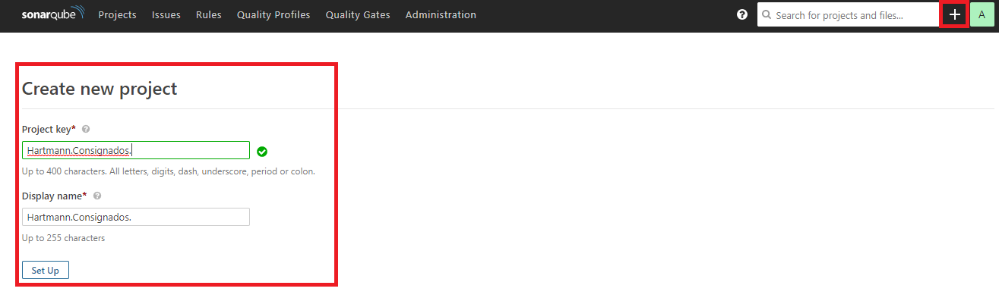
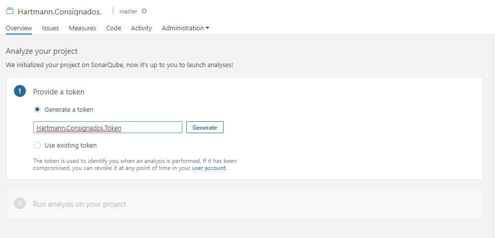
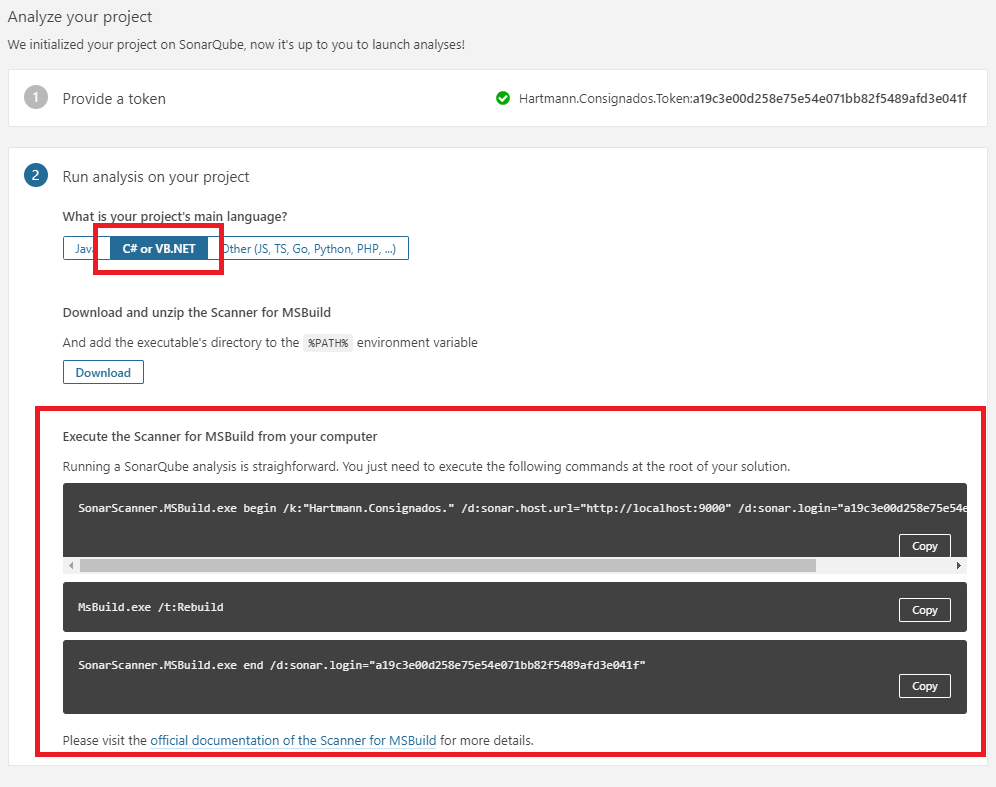
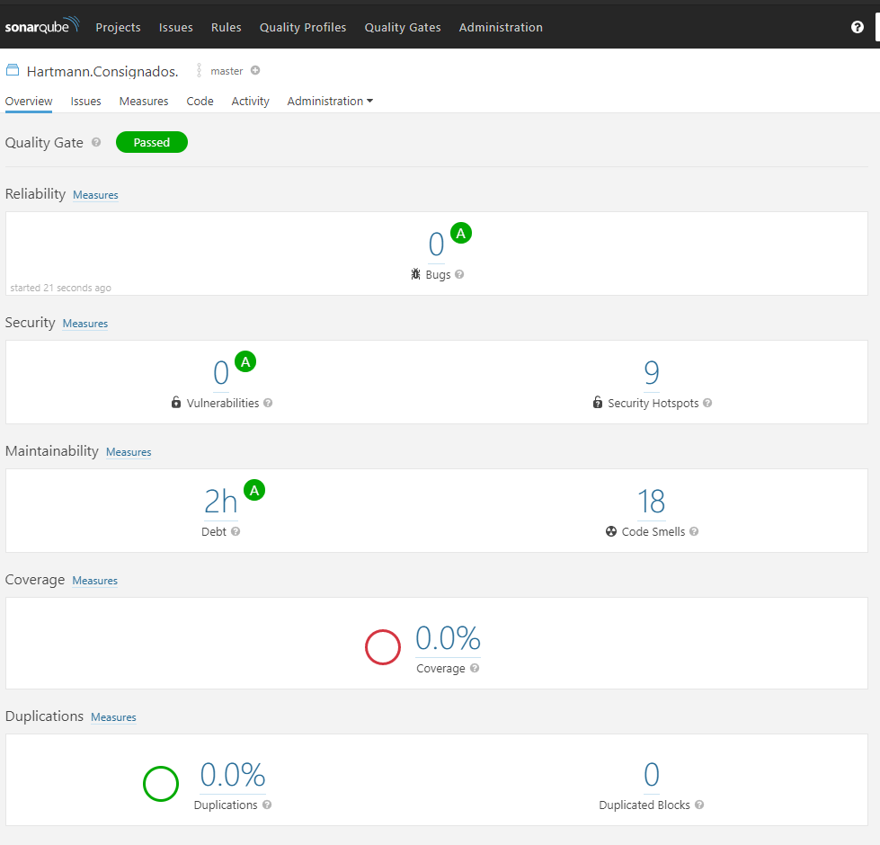

## O que é?
Exemplo para gerar Coverage e Sonar "local" antes de enviar para o servidor ou fazer commit e/ou Pull Request

## Pré-requisitos
- [Docker](https://www.docker.com/products/docker-desktop)
- [Java JDK](https://www.oracle.com/java/technologies/javase-jdk11-downloads.html)
- [Sonar Scanner](https://www.nuget.org/packages/dotnet-sonarscanner/4.8.0)
- [Report Generator](https://github.com/danielpalme/ReportGenerator)

## Instalações 

### SonarQube com Docker
```
docker run -d --name sonarqube -p 9000:9000 sonarqube:7.9.3-community
```

### Sonar Scanner para .Net 
```
dotnet tool install --global dotnet-sonarscanner --version 4.8.0
```

### Report Generator
```
dotnet tool install -g dotnet-reportgenerator-globaltool
```

## Execução dos Testes de unidade (Unit test)
No projeto de teste instalar a seguinte dependência: 
Essa dependência será responsável de gerar o nosso code coverage
```
dotnet add package coverlet.collector
```

## Execução dos testes 
Dentro da pasta do projeto, executar o seguinte comando: <br>
OBS: após o comando dotnet test é necessário colocar o caminho do projeto que vamos executar os testes de unidade (unit tests)
```
dotnet test tests/Hartmann.Consignados.Tests/Hartmann.Consignados.Tests.csproj /p:CollectCoverage=true /p:CoverletOutputFormat=opencover /p:CoverletOutput=Coverage/ 
```

## Resultado
Executando o comando de testes acima:

Resultado do comando executado:

Podemos observar que ele gerou uma pasta com o nome de "Coverage" e a cobertura no nosso consome

## Gerando o HTML de Coverage
Na pasta do projeto executar o seguinte comando:<br>
OBS: É preciso informar a pasta que foi gerado o coverage anteriormente e no -targetdir podemos informar a pasta de preferência para geração do nosso HTML de Coverage.
```
reportgenerator "-reports:C:\LimaTeixeira\hartmann-consignados-backend\tests\Hartmann.Consignados.Tests\Coverage\coverage.opencover.xml" "-targetdir:C:\LimaTeixeira\hartmann-consignados-backend\tests\Hartmann.Consignados.Tests\Coverage"
```

## Resultado
Executando o comando para geração de coverage

Resultado do coverage agora em formato HTML

Mais um resultado do coverage para que possamos analisar nossa cobertura linha a linha
.png)

## SonarQube
Bom, chegamos ao ponto de utilizar o sonarqube com docker. <br>
Depois de instalar o Docker e subir o container do SonarQube precisamos acessar o seguinte caminho: http://localhost:9000/ e acessar com as credencias: admin:admin.

# Criando um projeto no Sonar
Nesse ponto precisamos dar um nome ao nosso projeto. <br>
OBS: Esse nome tem que ser único por projeto

# Criando um token para o projeto criado
Esse token será utilizado para vincular o nosso projeto e o SonarQube

# Execificando a linguagem
Nesse caso vamos utilizar o C# para fazer a analise do nosso projeto

# Utilizando o SonarScanner
Primeiro precisamos utilizar o seguinte comando:<br>
OBS: Precisamos executar os testes de unidade antes e gerar o coverage, para que o Sonar possa pegar esse resultado como referência.
Os parâmetros: /k: é a Key do projeto e o /d:sonar.login é o token que foi gerado
```
dotnet-sonarscanner begin /k:"Hartmann.Consignados." /d:sonar.host.url="http://localhost:9000" /d:sonar.login="a19c3e00d258e75e54e071bb82f5489afd3e041f" /d:sonar.cs.opencover.reportsPaths=tests\Hartmann.Consignados.Tests\Coverage\coverage.opencover.xml /d:sonar.coverage.exclusions="**Test*.cs"
```
Após iniciar o scan do sonar é precisar executar o seguinte comando:
```
dotnet build
```
Após "buildar" o nosso projeto precisamos encerrar o scanner do sonar com o seguinte comando:
```
dotnet-sonarscanner end /d:sonar.login="a19c3e00d258e75e54e071bb82f5489afd3e041f"
```
## Resultado do SonarQube
Agora precisamos acessar o nosso SonarQube que está rodando local

Analisando Code Smells
.png)

Bom, por enquanto é isso, espero que tenham gostado.

Obrigado!